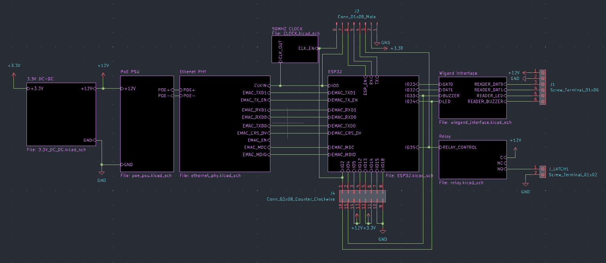

# Zamkonator - a PoE powered electronic lock system

**INFO**: This project is in a work in progress state and is not yet complete.

This is a repository for the hardware and software for a PoE powered locks system. It reads RFID cards using the [Wiegand interface](https://en.wikipedia.org/wiki/Wiegand_interface), and opens an electronic door latch to grant entry. This project simplifies the deployment of such systems by eliminating the need for a separate power supply for the lock. Additionally it connects directly to a LDAP server to authenticate users, thus removing any central coordination between multiple locks.

## Hardware overview



The system is based on the ESP32 SoC and the RTL8201F PHY. The PoE power supply is supplied by the [SI3404-A-GM](https://datasheet.lcsc.com/lcsc/2108241830_SILICON-LABS-SI3404-A-GMR_C461934.pdf) IC. To provide an extra layer of safety, the Wiegand interface is isolated using optocouplers and the lock is controlled via a relay to eliminate any possibility of surges occuring in long cables.

[Full PDF schematic](./schematic.pdf)


## Firmware

The firmware is located in the `zamek-firmware/` directory. To build it you will need ESP-IDF 4.4.2.

### Building

```sh
# with the ESP-IDF activated, in the zamek-firmware/ directory
idf.py build
```

Alternatively you can use included nix shell, which automatically downloads and activates the ESP-IDF.

```sh
nix develop
idf.py build
```

### Flashing

```sh
# with the ESP-IDF activated
idf.py flash
```

If you are flashing a board for the first time you will also need to flash the littlefs partition. To do that run:

```sh
./flash_littlefs.sh
```

# License

MIT
